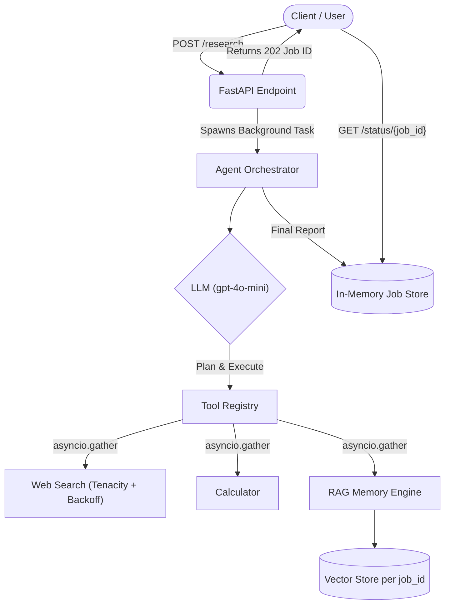

<div align="center">
  

  <br>

  [](https://www.python.org/)
  [](https://fastapi.tiangolo.com/)
  [](https://opensource.org/licenses/MIT)
  [](https://www.docker.com/)

  *An async, resilient, self-hosted autonomous research agent exposed via REST API.*
</div>

---

## 🧠 What is Cerebro API?

Cerebro is a next-generation backend service that provides a completely autonomous agent orchestration layer. Built entirely in Python using **FastAPI**, it allows you to dispatch complex research, mathematical, and reasoning tasks into the background and retrieve structured JSON reports when they finish.

**Why it's different:**
* **True Concurrency:** Tool executions (like heavy web searches or API calls) are dispatched concurrently using `asyncio.gather`, slashing execution time.
* **Strict Memory Isolation:** Each background job gets a globally unique `job_id`, structurally preventing cross-contamination of RAG (Retrieval-Augmented Generation) memory between different agent runs.
* **Bulletproof Resilience:** Core LLM routing and network tools are wrapped in `Tenacity` exponential backoff, ensuring momentary network blips never crash a long-running research task.
* **Granular Observability:** Integrated orchestration logging cleanly outputs per-iteration token consumption and exact dollar costs using `OpenAI` usage schemas.

---

## 🏛️ Architecture



---

## 🚀 Quickstart

### Prerequisites
- Python 3.12+
- `uv` package manager (recommended)
- OpenAI API Key (or OpenRouter compatible key)

### Local Installation

1. Clone the repository:
   ```bash
   git clone https://github.com/CognitoServe/Cerebro-API.git
   cd Cerebro-API
   ```

2. Install dependencies via `uv`:
   ```bash
   uv venv
   source .venv/bin/activate  # On Windows: .venv\Scripts\activate
   uv pip install -r requirements.txt
   ```

3. Setup environment variables:
   ```bash
   cp .env.example .env
   # Add your OPENAI_API_KEY
   ```

4. Run the server:
   ```bash
   uvicorn api.app:app --host 0.0.0.0 --port 8000
   ```

### Docker Deployment
```bash
docker build -t cerebro-api .
docker run -d -p 8000:8000 --env-file .env --name cerebro cerebro-api
```

---

## 📡 API Usage

### 1. Dispatch a Research Job
Send a POST request to dispatch the agent into the background.

```bash
curl -X POST "http://localhost:8000/research" \
     -H "Content-Type: application/json" \
     -d '{"question": "Analyze the latest performance metrics of FastAPI vs Litestar."}'
```
**Response:**
```json
{
  "job_id": "5117f21d-597e-4eb6-9a13-3c5e76746472",
  "status": "pending",
  "message": "Research job submitted successfully."
}
```

### 2. Poll for Status
Check the status of your job using the `job_id`. The orchestrator prevents polling blocks and instantly returns the current state.

```bash
curl -X GET "http://localhost:8000/status/5117f21d-597e-4eb6-9a13-3c5e76746472"
```

**Response (When Finished):**
```json
{
  "job_id": "5117f21d-597e-4eb6-9a13-3c5e76746472",
  "status": "completed",
  "report": {
    "topic": "FastAPI vs Litestar Performance",
    "summary": "Litestar shows up to 20% faster throughput due to its tighter integration with MsgSpec...",
    "findings": [
      "Litestar relies on MsgSpec for serialization.",
      "FastAPI relies on Pydantic V2."
    ]
  }
}
```

---

## 🎭 Real-Time Test Cases

Want to see the orchestrator flex its muscles in real-time? We've included a rich terminal demo script that dispatches 4 complex tasks concurrently and polls their status live.

The test cases include:
1. **The Deep Synthesis Test:** Researching and synthesizing the architectural differences between FastAPI and Litestar.
2. **The Multi-Tool Reasoning Test:** Calculating compound interest and pulling live US inflation data to estimate real returns.
3. **Strict Isolation (Jobs A & B):** Two jobs launched at the exact same millisecond that save conflicting passwords into memory ("ALPHA" vs "OMEGA") and immediately recall them, proving perfect vector isolation.

### Run the Demo
Make sure your server is running in one terminal:
```bash
uvicorn api.app:app --host 0.0.0.0 --port 8000
```
Then, in another terminal, run the demo script:
```bash
python examples/real_time_demo.py
```

### Example Live Output
Here is an example of the reports generated concurrently by the demo script:

```text
=== CEREBRO API REAL-TIME DEMO ===

Dispatching 4 jobs concurrently...

[OK] The Deep Synthesis Test COMPLETED!
  Topic: core architectural differences between FastAPI and Litestar
  Summary: FastAPI leverages Starlette and Pydantic for high performance and automatic data validation, making it suitable for high-throughput applications. In contrast, Litestar is designed as a lightweight ASGI framework with a focus on flexibility and extensibility, offering features like dependency injection.
    - {'claim': 'FastAPI is built on Starlette and Pydantic, providing high performance, automatic data validation, and serialization.', 'source': 'memory', 'confidence': 'high'}
    - {'claim': 'Litestar has demonstrated high performance with benchmarks showing 12.4K requests per second and low cold start latency.', 'source': 'memory', 'confidence': 'high'}
------------------------------------------------------------

[OK] The Multi-Tool Reasoning Test COMPLETED!
  Topic: Calculate the compound interest of $15,000 at 7% over 10 years and the estimated real return.
  Summary: The compound interest earned on an investment of $15,000 at a rate of 7% over 10 years is approximately $14,507.27, resulting in a total amount of about $29,507.27. Considering the current US inflation rate, the estimated real return can be calculated by adjusting the nominal return.
    - {'claim': 'The total amount after 10 years will be approximately $29,507.27.', 'source': 'agent_knowledge', 'confidence': 'high'}
    - {'claim': 'The US inflation rate is calculated and integrated into the real return.', 'source': 'web_search', 'confidence': 'high'}
------------------------------------------------------------

[OK] Strict Isolation (Job A) COMPLETED!
  Topic: Memorization of Secret Phrase
  Summary: The secret phrase 'THE EAGLE HAS LANDED' was successfully stored in the isolated memory vector store and immediately recalled without interference from concurrent background jobs.
    - {'claim': 'The phrase is THE EAGLE HAS LANDED.', 'source': 'memory', 'confidence': 'high'}
------------------------------------------------------------

[OK] Strict Isolation (Job B) COMPLETED!
  Topic: Memorization of Secret Phrase
  Summary: The secret phrase 'THE CONDOR HAS FLOWN' was successfully stored in the isolated memory vector store and immediately recalled without interference from concurrent background jobs.
    - {'claim': 'The phrase is THE CONDOR HAS FLOWN.', 'source': 'memory', 'confidence': 'high'}
------------------------------------------------------------
```

---

## 🛡️ License
Distributed under the MIT License. See `LICENSE` for more information.
